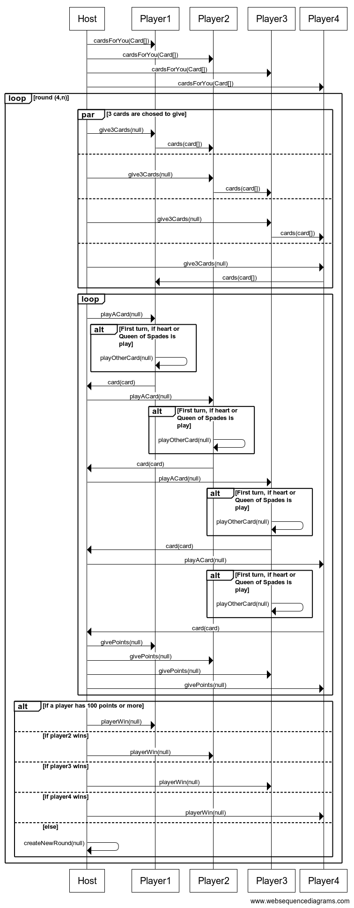

# Règles

Le jeu de Dame de Pique se joue avec quatre joueurs, chacun jouant individuellement (sans équipes), et un jeu de 52 cartes standard auquel un joker est ajouté. Les règles de base restent similaires, avec les ajustements suivants pour intégrer les nouvelles variantes.

## Mise en place

Les cartes sont mélangées et distribuées entièrement, chaque joueur recevant 13 cartes. Avant le début de chaque manche, les joueurs choisissent trois cartes à passer à un autre joueur selon un schéma prédéfini:
 - 1ère manche: à gauche
 - 2ème manche: à droite 
 - 3ème manche: en face
 - 4ème manche: pas de cartes échangé

Puis on continue ce schéma jusqu’à la fin du jeu.

L’ordre des cartes va de la plus faible à la plus forte: 2, 3, 4, 5, 6, 7, 8, 9, 10, Valet, Dame, Roi, As.

## Déroulé de la partie

Le joueur possédant le 2♣ commence le tour en jouant cette carte. Les autres joueurs doivent suivre la couleur si possible. Si un joueur ne peut pas suivre, il peut jouer une carte d'une autre couleur, sauf restriction: 
  -Les cœurs ne peuvent pas être joués tant qu’ils n’ont pas été "cassés".
  -Les coeurs ne peuvent pas être joués au premier tour.
  -La dame de pique ne peut pas être joué au premier tour.

Le tour est remportée par le joueur ayant joué la carte la plus haute de la couleur demandée. Le vainqueur du tour commence la suivante.

## Objectif du jeu

Le but est d’éviter de marquer des points en évitant de remporter certaines cartes :

  - Chaque cœur vaut 1 point.
  - La Dame de Pique vaut 13 points.
  - Cependant, un joueur peut choisir de tenter un "Grand Chelem" (ou "Faire la Lune") : capturer tous les cœurs et la Dame de Pique. Si réussi, ce joueur marque 0 point et les autres joueurs marquent chacun 26 points.

## Règle Bonus

A chaque tour, la somme de la valeur des cartes est calculé:
- Si la somme des valeurs des cartes jouées dans un tour atteint exactement 20, le joueur qui tape le dernier au milieu prend les cartes.
  En réseau : Géré numériquement. 
  En local : Un tirage au sort de réflexe peut être organisé.

- Lorsque la somme des cartes atteint exactement 21, un échange de mains est déclenché :
  Chaque joueur donne sa main actuelle au joueur situé à sa droite.
  Les points collectés lors de cette levée sont également transférés avec la main.

- Au début de chaque manche un joker est désigné parmi les cartes ne valant pas de points, son rôle: valoir 1 point. Il peut être joué n’importe quand après le premier tour. 

## Fin de la partie

La partie continue sur plusieurs manches jusqu’à ce qu’un joueur atteigne ou dépasse un score de 100. Le gagnant est celui ayant le score le plus bas à la fin de la partie.

### Détail des classes principales

- LocalDameDePiqueGame la version du jeu supportant le jeu en local
- DameDePiqueGameEngine le moteur du jeu
- DameDePiqueGameNetorkPlayer le joueur distant en cas de partie réseau
- DameDePiqueGameNetworkEngine la version du jeu supportant le réseau

# Protocole réseau

>Le protocole réseau définit les séquences des commandes échangées entre les différentes parties prenantes. Il doit contenir, pour chaque commande, l'expéditeur, le destinataire, le nom de la commande et le contenu du corps de la commande

